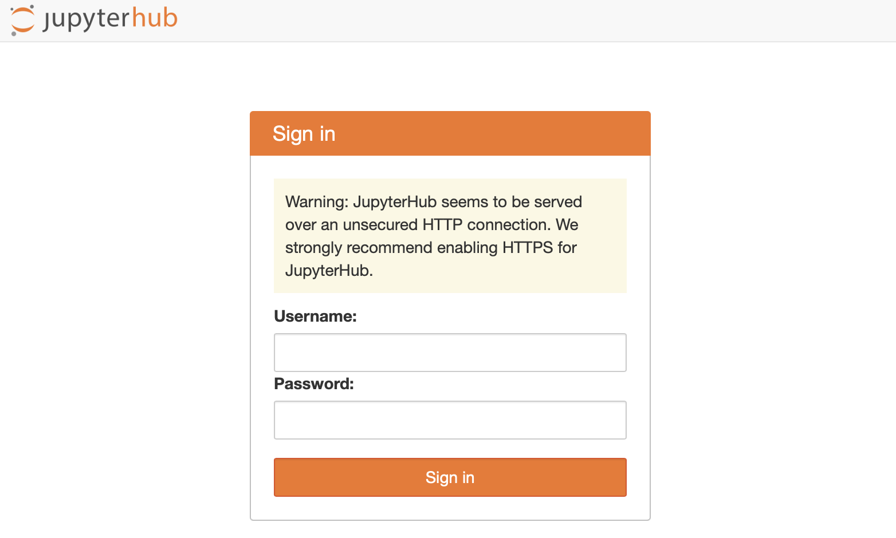
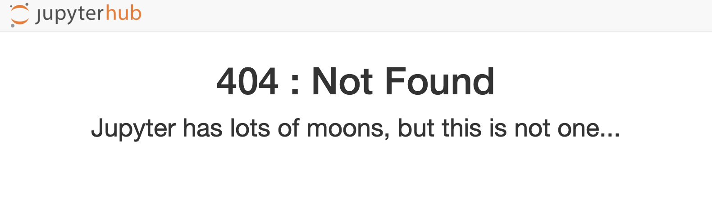

# Acesso ao servidor jupyterhub na woodshole

O nosso servidor jupyterhub está disponível como um serviço na porta `9999` da woodshole. Se você estiver na rede do DOF, bastar utilizar o endereço da woodshole e a porta do jupyterhub direto em seu browser. Caso esteja fora da rede do DOF, é preciso criar um túnel SSH, através do servidor `door`.  Siga as instruções abaixo.

## Acesso a partir da rede do DOF

Na barra de endereços do browser de seu computador digite:

    woodshole.io.usp.br:9999

Na página de entrada do servidor jupyterhub, digite o usurário e senha de sua conta na woodshole.

> [!IMPORTANT]  
> Se por acaso você obter erro 404 (page not found), clique no ícone do jupyterhub no canto superior esquerdo para acessar a página de log in.

## Acesso remoto

### Túnel SSH
Para criar o túnel, abra um terminal em seu computador e digite:

    ssh -Y -f labcrocha@door.io.usp.br -N -L 9999:woodshole:9999

A senha de `labcrocha` na servidor `door` será solicitada. Caso não tenha acesso a esta senha, contacte nosso suporte TI ou o César.

O comando acima cria um túnel da woodshole (o servidor remoto) para o seu computador (o localhost). Por conveniência, escolhemos mapear o serviço da porta `9999` da woodshole para a porta `9999` do localhost. Se esta porta do localhost já estiver sendo utilizada, você pode substituí-la por outra porta: `XXXX:woodshole:9999`, onde `XXXX` é o número da porta escolhida para o localhost. Preferencialmente, esta porta dever ter número acima de 8000. 

> [!IMPORTANT]  
> Se seu computador local rodar Windows, baixe o [Visual Studio Code](https://code.visualstudio.com). Este editor de texto contém um terminal, que você pode utilizar para criar o túnel.

### Jupyterhub

Após criar o túnel, você pode abrir o jupyterhub, digitando o seguinte na barra de endereços de seu browser:

    localhost:9999

